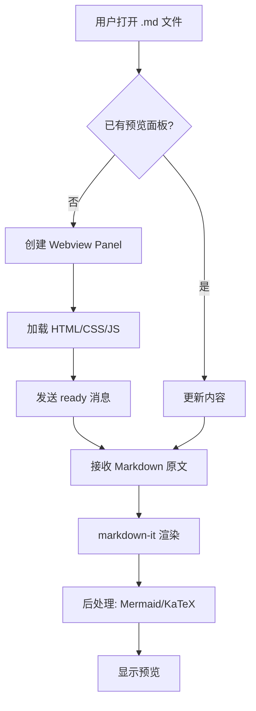
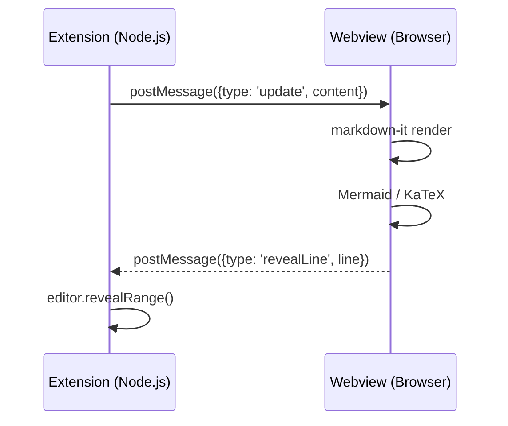
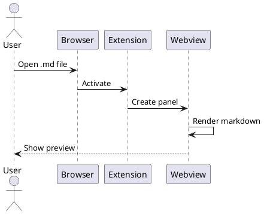

# Markdown Super 功能测试

## 1. 基础排版

这是一个**加粗**文本，这是*斜体*文本，这是`行内代码`。

这是一个[链接](https://github.com)。

> 这是一段引用文本
> 支持多行引用

---

## 2. 代码块（复制按钮 + 语言标签）

```python
def fibonacci(n):
    """计算斐波那契数列"""
    if n <= 1:
        return n
    a, b = 0, 1
    for _ in range(2, n + 1):
        a, b = b, a + b
    return b

# 测试
for i in range(10):
    print(f"F({i}) = {fibonacci(i)}")
```

```javascript
const express = require('express');
const app = express();

app.get('/api/hello', (req, res) => {
  res.json({ message: 'Hello, World!' });
});

app.listen(3000, () => {
  console.log('Server running on port 3000');
});
```

```sql
SELECT u.name, COUNT(o.id) AS order_count
FROM users u
LEFT JOIN orders o ON u.id = o.user_id
WHERE u.created_at > '2025-01-01'
GROUP BY u.name
HAVING order_count > 5
ORDER BY order_count DESC;
```

## 3. 表格

| 功能 | 状态 | 说明 |
|------|------|------|
| 滚动同步 | 已实现 | 双向同步 |
| 主题切换 | 已实现 | Auto / Light |
| 代码块增强 | 已实现 | 复制按钮 + 语言标签 |
| KaTeX | 已实现 | 行内 + 块级 |
| Mermaid | 已实现 | 延迟加载 |

## 4. 任务列表

- [x] 项目初始化
- [x] 基础预览
- [x] M1 功能开发
- [ ] M2 图片粘贴
- [ ] M3 大纲侧边栏

## 5. KaTeX 数学公式

行内公式：$E = mc^2$，以及 $\int_{-\infty}^{\infty} e^{-x^2} dx = \sqrt{\pi}$

块级公式：

$$
\frac{\partial f}{\partial x} = \lim_{h \to 0} \frac{f(x+h) - f(x)}{h}
$$

$$
\sum_{n=1}^{\infty} \frac{1}{n^2} = \frac{\pi^2}{6}
$$

## 6. Mermaid 图表





## 7. 脚注

这是一个带脚注的文本[^1]，以及另一个脚注[^2]。

[^1]: 这是第一个脚注的内容。
[^2]: 这是第二个脚注，支持**Markdown格式**。

## 8. 嵌套列表

1. 第一层
   - 第二层 a
   - 第二层 b
     1. 第三层 1
     2. 第三层 2
2. 第一层继续
   - 另一个第二层

## 9. 长文本（滚动同步测试）

Lorem ipsum dolor sit amet, consectetur adipiscing elit. Sed do eiusmod tempor incididunt ut labore et dolore magna aliqua.

Ut enim ad minim veniam, quis nostrud exercitation ullamco laboris nisi ut aliquip ex ea commodo consequat.

Duis aute irure dolor in reprehenderit in voluptate velit esse cillum dolore eu fugiat nulla pariatur.

Excepteur sint occaecat cupidatat non proident, sunt in culpa qui officia deserunt mollit anim id est laborum.

这里是文档的底部，如果你能看到这里，说明滚动同步工作正常！

## 10. PlantUML 图表



## 11. Markmap 思维导图

```markmap
# Markdown Super
## 预览
- 实时渲染
- 滚动同步
- 主题切换
## 图表
- Mermaid
- PlantUML
- Markmap
## 编辑
- 快捷格式化
- 图片粘贴
- 拖拽插入
## 工具
- TOC 大纲
- 字数统计
- 预览搜索
```

## 12. 快捷键测试

试试选中文本后按：
- **Ctrl+B**：加粗
- **Ctrl+I**：斜体
- **Ctrl+Shift+C**：行内代码
- **Ctrl+K**：插入链接
- **Ctrl+F**（在预览面板中）：搜索
