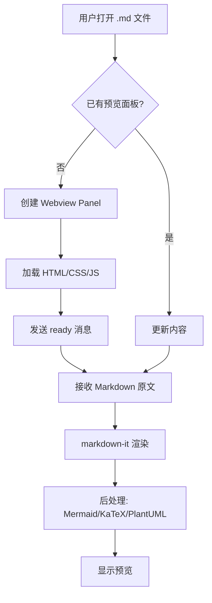
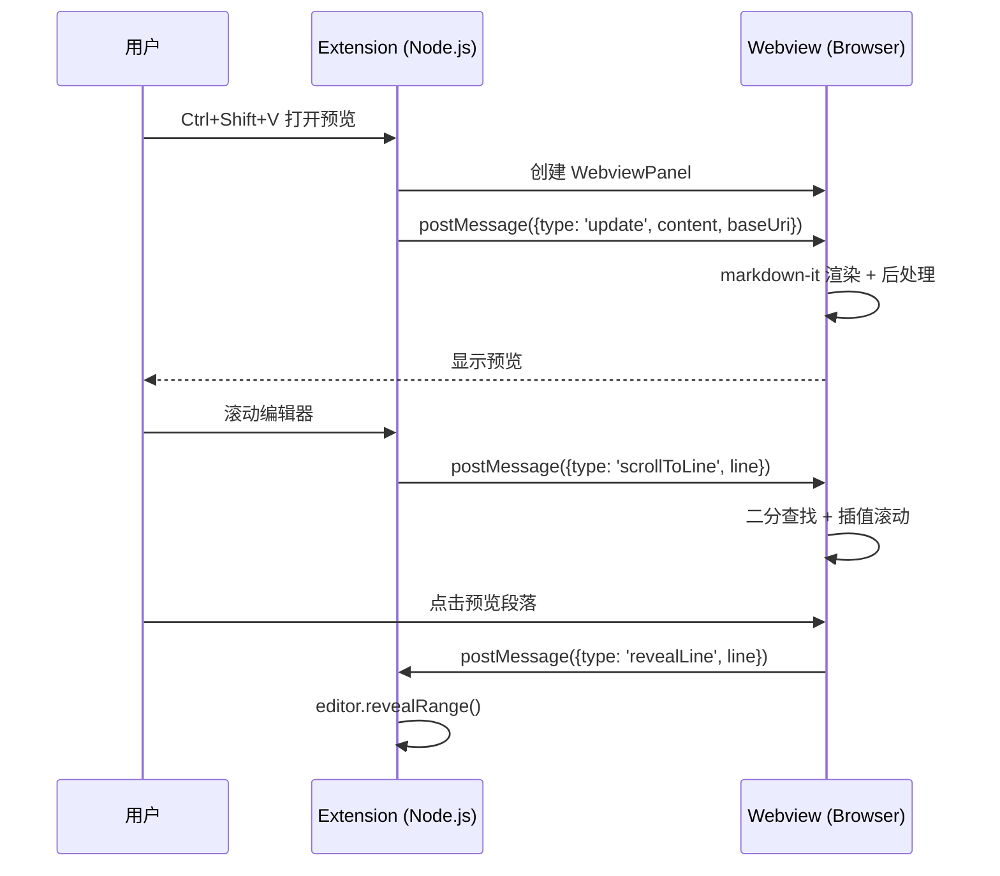
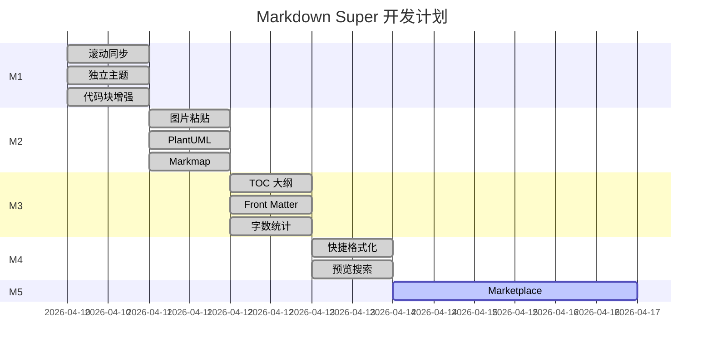
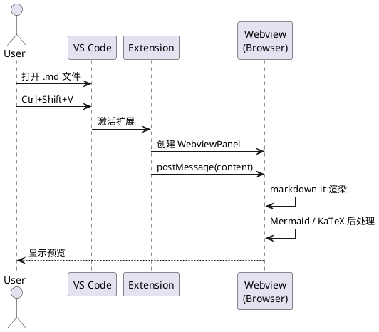

# Markdown Super 功能全面测试

> 本文档覆盖 M1~M4 的所有功能，请逐一验证。

**快速跳转**: [GFM Alert](#17-gfm-alert) | [锚点链接](#18-锚点链接测试) | [Emoji](#19-emoji-表情) | [图片放大](#10-图片显示测试)

---

## 1. Front Matter 卡片

上方的 YAML 头部应该渲染为一个**信息卡片**（表格样式），而不是原始的 `---` 文本。

验证项：
- [ ] 卡片显示 title、date、author、tags、version 五行
- [ ] 浅色/暗色模式下样式正确

---

## 2. 基础排版

**加粗文本**、*斜体文本*、***粗斜体***、~~删除线~~、`行内代码`

这是一个 [普通链接](https://github.com)，这是一个 **[加粗链接](https://github.com)**。

> 引用文本，支持 **Markdown 格式**
>
> > 嵌套引用也可以

分割线下方 👇

---

有序列表：
1. 第一项
2. 第二项
   1. 嵌套有序 a
   2. 嵌套有序 b
3. 第三项

无序列表：
- 苹果
- 香蕉
  - 小香蕉
  - 大香蕉
- 橙子

---

## 3. 任务列表

- [x] M1 滚动同步
- [x] M1 独立主题
- [x] M1 代码块增强
- [x] M2 图片粘贴/拖拽
- [x] M2 PlantUML
- [x] M2 Markmap
- [x] M3 TOC 大纲
- [x] M3 Front Matter
- [x] M3 字数统计
- [x] M4 快捷格式化
- [x] M4 预览搜索
- [ ] M5 Marketplace 上架

---

## 4. 表格

| 功能 | 快捷键 | 状态 | 备注 |
|------|--------|------|------|
| 加粗 | `Ctrl+B` | ✅ | toggle 切换 |
| 斜体 | `Ctrl+I` | ✅ | toggle 切换 |
| 行内代码 | `Ctrl+Shift+C` | ✅ | toggle 切换 |
| 插入链接 | `Ctrl+K` | ✅ | snippet 模式 |
| 插入图片 | `Ctrl+Shift+K` | ✅ | snippet 模式 |
| 删除线 | — | ✅ | 命令面板调用 |

---

## 5. 代码块增强

### Python 示例

```python
from dataclasses import dataclass
from typing import List

@dataclass
class TodoItem:
    title: str
    completed: bool = False
    tags: List[str] = None

    def toggle(self):
        self.completed = not self.completed

# 使用示例
items = [
    TodoItem("写 PRD", True, ["planning"]),
    TodoItem("开发 M1", True, ["dev"]),
    TodoItem("上架 Marketplace", False, ["release"]),
]

for item in items:
    status = "✅" if item.completed else "⬜"
    print(f"{status} {item.title}")
```

### TypeScript 示例

```typescript
interface PreviewConfig {
  mermaidEnabled: boolean;
  katexEnabled: boolean;
  theme: "auto" | "light";
  fontSize: number;
  lineNumbers: boolean;
}

function scheduleRender(markdown: string): void {
  if (renderTimer) clearTimeout(renderTimer);
  renderTimer = setTimeout(() => doRender(markdown), 50);
}
```

### SQL 示例

```sql
WITH monthly_stats AS (
  SELECT
    DATE_TRUNC('month', created_at) AS month,
    COUNT(*) AS total_orders,
    SUM(amount) AS revenue,
    AVG(amount) AS avg_order_value
  FROM orders
  WHERE status = 'completed'
  GROUP BY 1
)
SELECT
  month,
  total_orders,
  revenue,
  avg_order_value,
  LAG(revenue) OVER (ORDER BY month) AS prev_month_revenue,
  ROUND((revenue - LAG(revenue) OVER (ORDER BY month)) / LAG(revenue) OVER (ORDER BY month) * 100, 1) AS growth_pct
FROM monthly_stats
ORDER BY month DESC;
```

### 无语言标识的代码块

```
这个代码块没有指定语言
所以没有语法高亮
但应该仍然有背景色和正确的字体
```

### 行内代码

使用 `npm install` 安装依赖，然后 `npm run build` 构建，用 `F5` 启动调试。

---

## 6. KaTeX 数学公式

### 行内公式

爱因斯坦质能方程 $E = mc^2$，欧拉公式 $e^{i\pi} + 1 = 0$，求和 $\sum_{i=1}^{n} i = \frac{n(n+1)}{2}$。

### 块级公式

高斯积分：

$$
\int_{-\infty}^{\infty} e^{-x^2} dx = \sqrt{\pi}
$$

麦克斯韦方程组（微分形式）：

$$
\nabla \cdot \mathbf{E} = \frac{\rho}{\varepsilon_0}, \quad
\nabla \cdot \mathbf{B} = 0, \quad
\nabla \times \mathbf{E} = -\frac{\partial \mathbf{B}}{\partial t}, \quad
\nabla \times \mathbf{B} = \mu_0 \mathbf{J} + \mu_0 \varepsilon_0 \frac{\partial \mathbf{E}}{\partial t}
$$

矩阵：

$$
\begin{pmatrix}
a_{11} & a_{12} & a_{13} \\
a_{21} & a_{22} & a_{23} \\
a_{31} & a_{32} & a_{33}
\end{pmatrix}
\begin{pmatrix}
x_1 \\ x_2 \\ x_3
\end{pmatrix}
=
\begin{pmatrix}
b_1 \\ b_2 \\ b_3
\end{pmatrix}
$$

---

## 7. Mermaid 图表

### 流程图



### 时序图



### 甘特图



---

## 8. PlantUML 图表



---

## 9. Markmap 思维导图

```markmap
# VS Code 插件架构
## 扩展端 (Node.js)
- extension.ts 入口
- PreviewPanel 面板管理
- 功能模块
  - image-paste 图片粘贴
  - formatting 快捷格式化
  - outline TOC 大纲
  - word-count 字数统计
## Webview 端 (Browser)
- main.ts 渲染管线
- markdown-it 插件
  - source-line 行号注入
  - frontmatter 卡片
- 渲染器
  - code-block 代码增强
  - mermaid 图表
  - katex 公式
  - plantuml 图表
  - markmap 思维导图
- 功能
  - search 预览搜索
## 构建
- esbuild 双目标
- TypeScript 双配置
```

---

## 10. 图片显示测试

### 网络图片


### 本地图片（粘贴测试）

在编辑器里截图后 Ctrl+V 粘贴，图片应该保存到 `./assets/` 目录并自动插入链接。

---

## 11. 脚注

这是一个带脚注的文本[^1]，以及另一个脚注[^note]。

[^1]: markdown-it 的脚注插件实现，支持自动编号。

[^note]: 脚注支持**粗体**、`代码`等 Markdown 格式，以及多行内容。

    第二段脚注内容。

---

## 12. 快捷键测试

在编辑器中选中下面的文本，然后按快捷键测试：

这段文本用来测试加粗 Ctrl+B
这段文本用来测试斜体 Ctrl+I
这段文本用来测试行内代码 Ctrl+Shift+C
在这里按 Ctrl+K 插入链接
在这里按 Ctrl+Shift+K 插入图片

---

## 13. 预览搜索测试

在预览面板中按 **Ctrl+F**，搜索以下关键词验证高亮效果：

- 搜索 "markdown" — 应该有多处匹配
- 搜索 "KaTeX" — 应该有几处匹配
- 搜索 "不存在的词" — 应该显示 "No results"
- 按 Enter 和 Shift+Enter 在结果间跳转

---

## 14. 滚动同步测试

下面是填充文本，用于测试长文档滚动同步。

### 14.1 第一段

Lorem ipsum dolor sit amet, consectetur adipiscing elit. Sed do eiusmod tempor incididunt ut labore et dolore magna aliqua. Ut enim ad minim veniam, quis nostrud exercitation ullamco laboris nisi ut aliquip ex ea commodo consequat.

Duis aute irure dolor in reprehenderit in voluptate velit esse cillum dolore eu fugiat nulla pariatur. Excepteur sint occaecat cupidatat non proident, sunt in culpa qui officia deserunt mollit anim id est laborum.

### 14.2 第二段

Sed ut perspiciatis unde omnis iste natus error sit voluptatem accusantium doloremque laudantium, totam rem aperiam, eaque ipsa quae ab illo inventore veritatis et quasi architecto beatae vitae dicta sunt explicabo.

Nemo enim ipsam voluptatem quia voluptas sit aspernatur aut odit aut fugit, sed quia consequuntur magni dolores eos qui ratione voluptatem sequi nesciunt.

### 14.3 第三段

At vero eos et accusamus et iusto odio dignissimos ducimus qui blanditiis praesentium voluptatum deleniti atque corrupti quos dolores et quas molestias excepturi sint occaecati cupiditate non provident.

Similique sunt in culpa qui officia deserunt mollitia animi, id est laborum et dolorum fuga.

---

## 15. 主题切换测试

点击预览面板右上角的 🎨 按钮切换主题：

- **浅色模式**：白底（#fff）+ 深灰文字（#1a1a1a）+ GitHub 风格语法高亮
- **跟随 VS Code**：跟随当前 VS Code 主题

验证项：
- [ ] 切换后代码块颜色正确
- [ ] 切换后表格、引用块样式正确
- [ ] 切换后 Mermaid 图表可读
- [ ] 切换后搜索栏样式正确

---

## 16. 字数统计

请查看 VS Code 右下角状态栏，应该显示类似：

```
📖 xxx 字 · 约 x 分钟
```

鼠标悬停应显示中文字数和英文词数的详细分类。

---

## 17. GFM Alert

> [!NOTE]
> 这是一个 Note 提示块，用于补充说明信息。

> [!TIP]
> 这是一个 Tip 提示块，提供有用的建议。比如：使用 `Ctrl+Shift+V` 打开预览。

> [!IMPORTANT]
> 这是一个 Important 提示块，标记重要信息。

> [!WARNING]
> 这是一个 Warning 提示块，提醒潜在风险。
> 
> 支持多段内容和**格式化**。

> [!CAUTION]
> 这是一个 Caution 提示块，标记危险操作。请勿在生产环境执行 `rm -rf /`。

---

## 18. 锚点链接测试

点击下面的链接应该跳转到文档对应位置：

- [跳到第 1 节 Front Matter](#1-front-matter-卡片)
- [跳到第 5 节代码块](#5-代码块增强)
- [跳到第 7 节 Mermaid](#7-mermaid-图表)
- [跳到第 17 节 GFM Alert](#17-gfm-alert)

---

## 19. Emoji 表情

:smile: :rocket: :thumbsup: :heart: :star: :fire: :tada: :warning: :bug: :memo:

写代码就像 :coffee: + :keyboard: = :sparkles:

---

## 20. 图片点击放大测试

点击下面的图片，应该弹出全屏大图查看，点击遮罩或按 Esc 关闭：


---

**🎉 测试完成！如果以上 20 项功能都正常，说明 Markdown Super v0.1.0 已就绪。**
